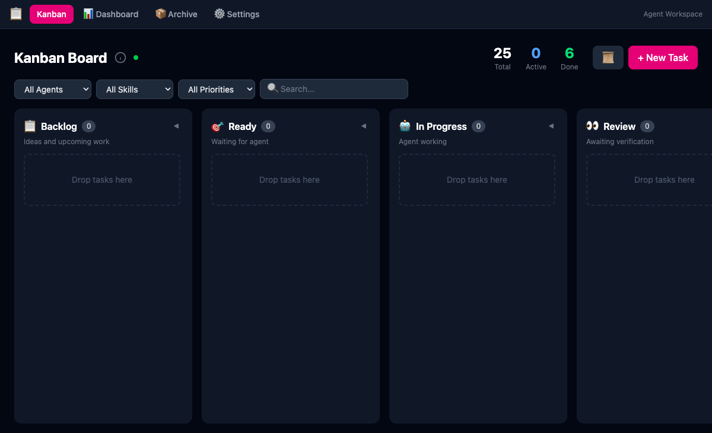
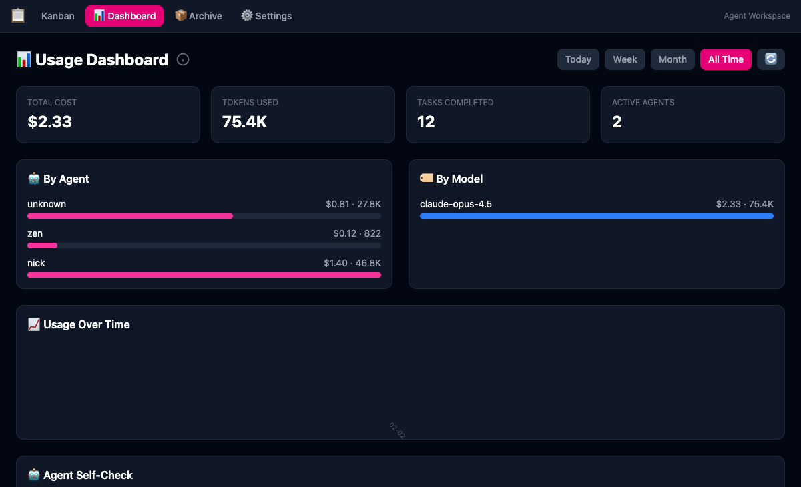
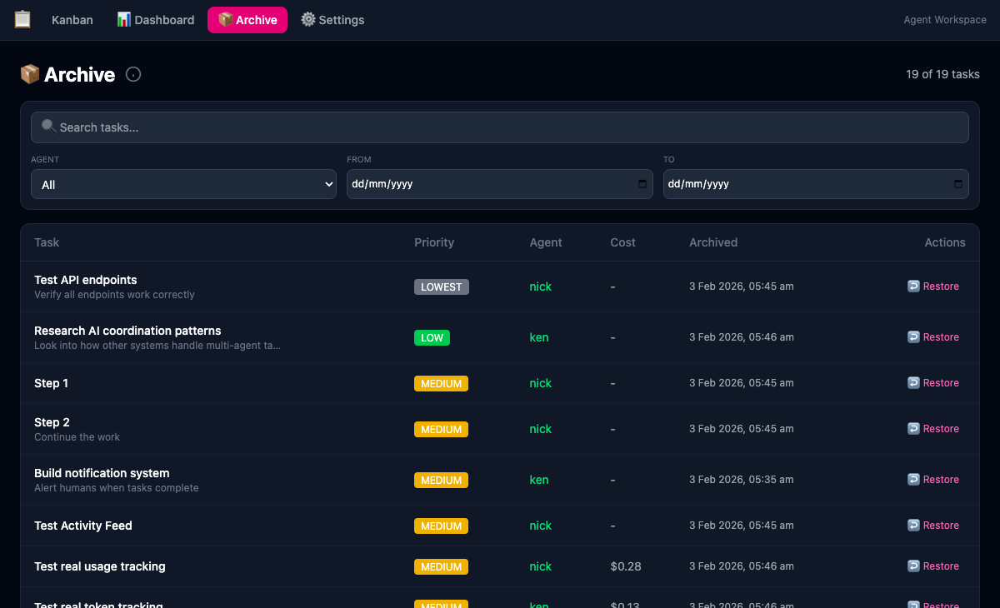
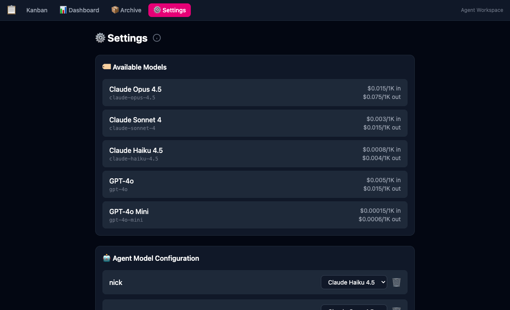

# 📋 Kanban

A lightweight kanban board for tracking AI agent tasks and usage. Built for dogfooding AI-assisted development workflows.

## Demo


## Screenshots

### Kanban Board
Drag-and-drop task management with columns for Backlog, Ready, In Progress, and Review.



### Usage Dashboard
Monitor costs, tokens, and activity across all agents.



### Archive
Browse and restore completed tasks with filtering options.



### Settings
Configure models and agent-specific pricing.



## Features

- **Kanban Board** — Drag-and-drop task management across Backlog → In Progress → Review → Done
- **Agent Tracking** — Track which AI agent (Nick, Claude, etc.) is working on each task
- **Usage Dashboard** — Monitor estimated costs and token usage per agent
- **Activity Feed** — Real-time updates on task changes
- **WebSocket Support** — Live updates across multiple clients
- **CLI Tool** — Command-line interface for agent integration
- **PWA Ready** — Installable as a Progressive Web App
- **User Authentication** — JWT-based auth with role-based access control

## Authentication & Onboarding

The app requires authentication. On first run, you'll be guided through setup.

### First-Time Setup

1. Start the API and UI servers (see Quick Start below)
2. Open http://localhost:5173 in your browser
3. You'll be redirected to `/setup` to create the admin account
4. Enter your email and password (min 8 characters)
5. Click "Create Admin Account" — you're now logged in

### Subsequent Logins

After setup is complete, visit the app and you'll see the login page. Enter your credentials to access the kanban board.

### User Roles

| Role | Permissions |
|------|-------------|
| **admin** | Full access: manage all tasks, create/edit/delete users |
| **user** | Limited access: can only see and manage their own tasks |

### Managing Users (Admin Only)

Admins can manage users via the **Users** nav link:
- Create new users with email/password/role
- Edit existing users (change role, reset password)
- Delete users (cannot delete yourself)

### Resetting the App

To start fresh and trigger the setup flow again:

```bash
rm kanban-api/data/kanban.db
# Restart the API server
```

## Architecture

```
kanban/
├── kanban-api/     # Backend API (TypeScript, Hono, SQLite)
├── kanban-ui/      # Frontend (React, Vite, TailwindCSS)
└── kanban-skill/   # CLI tool for OpenClaw agent integration
```

## Quick Start

### API Server

```bash
cd kanban-api
npm install
npm run dev
# Server runs on http://localhost:3000
```

### UI

```bash
cd kanban-ui
npm install
npm run dev
# UI runs on http://localhost:5173
```

### Environment

Create `.env` in `kanban-api/`:

```env
PORT=3000
DATABASE_PATH=./data/kanban.db
JWT_SECRET=your-secret-key-min-32-chars
JWT_REFRESH_SECRET=different-secret-key-min-32-chars
```

> **Note:** If JWT secrets are not set, random secrets are generated on startup (tokens won't persist across restarts).

## API Endpoints

| Method | Endpoint | Description |
|--------|----------|-------------|
| GET | `/tasks` | List all tasks |
| POST | `/tasks` | Create a task |
| PATCH | `/tasks/:id` | Update a task |
| DELETE | `/tasks/:id` | Delete a task |
| GET | `/stats` | Get usage statistics |
| GET | `/activities` | Get activity feed |
| GET | `/agents` | List agents with usage |
| GET | `/settings` | Get app settings |
| PATCH | `/settings` | Update settings |

## CLI Usage

The CLI tool allows agents to interact with the kanban board. Authentication is required.

### Setup

```bash
# Login to get an auth token
./kanban-skill/kanban-cli.sh login admin@example.com yourpassword

# Export the token (add to ~/.bashrc or ~/.zshrc for persistence)
export KANBAN_TOKEN="<token-from-login>"

# Verify authentication
./kanban-skill/kanban-cli.sh whoami
```

### Commands

```bash
# List tasks
./kanban-skill/kanban-cli.sh list

# Show task details
./kanban-skill/kanban-cli.sh show <task-id>

# Claim a task
./kanban-skill/kanban-cli.sh claim <task-id> <agent-name>

# Complete a task with usage tracking
./kanban-skill/kanban-cli.sh complete <task-id> <agent> <input_tokens> <output_tokens> <model>

# Block a task
./kanban-skill/kanban-cli.sh block <task-id> <agent> "reason"

# Release a claimed task
./kanban-skill/kanban-cli.sh release <task-id> <agent>

# View usage statistics
./kanban-skill/kanban-cli.sh stats
```

## Tech Stack

- **Backend**: TypeScript, Hono, better-sqlite3
- **Frontend**: React 18, Vite, TailwindCSS, React DnD
- **Database**: SQLite
- **Real-time**: WebSocket

## BMAD Setup

Integrate BMAD with OpenCode support to drive analyst, dev, and code review workflows.

### Install BMAD (alpha)

```text
npx bmad-method@alpha install
# When prompted, select "opencode" support
```

### Run workflows

```text
# Quick spec workflow
/bmd-bmm-quick-spec
```

```text
# Developer story workflow
/bmad-bmm-dev-story
```

# Code review workflow
/bmad-bmm-code-review
```

## License

MIT

---

Built with 🤖 by Nick & Ken during a late-night coding session.
